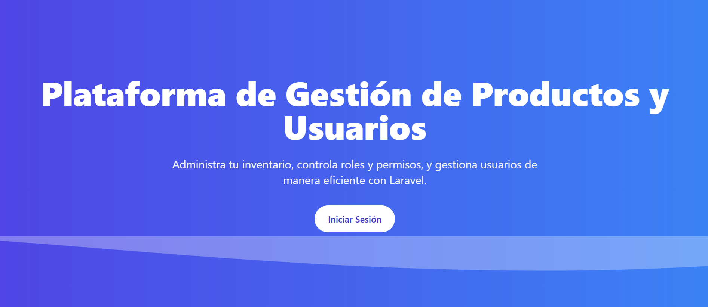

Aquí tienes un **README.md** profesional, claro y atractivo para tu proyecto Laravel:

---

# 🧩 Panel de Administración Laravel

Un panel de administración moderno desarrollado con **Laravel** y **Tailwind CSS**, que permite gestionar **usuarios, roles y productos** con un diseño elegante, responsive y seguro.

## 🚀 Características

- ✅ **CRUD completo** de usuarios, roles y productos
- 🔐 **Autenticación y control de permisos** con _Spatie Laravel Permission_
- ♻️ **Soft Deletes y restauración** de registros eliminados
- 🎨 **Interfaz moderna y responsive** usando Tailwind CSS y Animate.css
- 🧭 **Diseño modular y mantenible** para fácil escalabilidad
- ⚙️ **Sistema de roles y permisos** adaptable (Admin, Editor, Usuario, etc.)

## 🛠️ Tecnologías utilizadas

- [Laravel 10](https://laravel.com/)
- [Tailwind CSS](https://tailwindcss.com/)
- [Spatie Laravel Permission](https://spatie.be/docs/laravel-permission/)
- [Font Awesome](https://fontawesome.com/)
- [Animate.css](https://animate.style/)

## ⚡ Instalación

```bash
# Clonar el repositorio
git clone https://github.com/tuusuario/tu-repo.git

# Entrar en el proyecto
cd tu-repo

# Instalar dependencias
composer install
npm install && npm run dev

# Copiar el archivo de entorno
cp .env.example .env

# Generar la clave de aplicación
php artisan key:generate

# Configurar la base de datos en el archivo .env
# Luego ejecutar las migraciones y seeders
php artisan migrate --seed
```

## 🔑 Credenciales iniciales

```
Usuario: admin@example.com
Contraseña: password
```

## 🧰 Comandos útiles

```bash
php artisan serve          # Iniciar servidor local
npm run dev                # Compilar recursos en modo desarrollo
php artisan migrate:refresh --seed  # Reiniciar la BD con datos iniciales
```

## 💡 Estructura general

```
app/
 ├─ Http/
 │   ├─ Controllers/
 │   └─ Middleware/
 ├─ Models/
 ├─ Policies/
resources/
 ├─ views/
 │   ├─ users/
 │   ├─ products/
 │   └─ roles/
```

## 📱 Capturas



## 🧑‍💻 Autor

**Anthony Martínez**
Desarrollador web | Laravel & JS Enthusiast
📧 [antmarame@gmail.com](mailto:antmarame@gmail.com)
🌐 [LinkedIn](https://www.linkedin.com/in/anthony-martinez-amell/)

---

¿Quieres que le agregue una **sección de despliegue (Deploy en Render o Railway)** o lo dejamos como guía de instalación local?

## License

The Laravel framework is open-sourced software licensed under the [MIT license](https://opensource.org/licenses/MIT).
